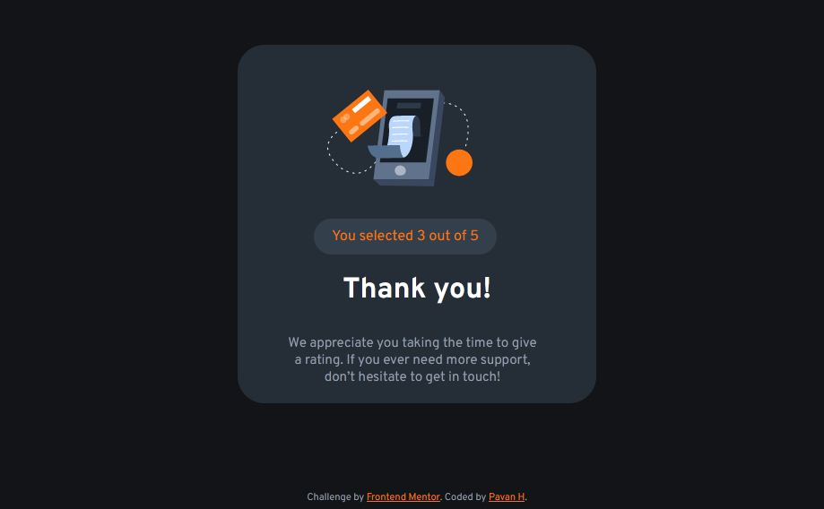
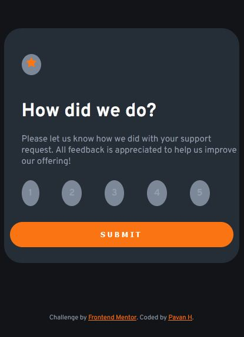

# Interactive-rating-component
This is a solution to **Frontend Mentor** challenge 

# Challenge 
- hover state of all components.
- get "thank you" page after submitting a rating.
- submit a number.
- responsive 

# preview 

